# (C# 코딩) 심플 사칙연산기 (SimpleCalculator)

## 개요
- C# 프로그래밍 학습
- 1줄 소개: 사용자로부터 수치와 연산자를 입력받아 사칙연산을 수행하고, 그 결과를 두 가지 방식(전체 수식, 최종 결과값)으로 화면에 출력하는 심플 사칙연산기 프로그램입니다.
- 사용한 플랫폼:
  - C#, .NET Windows Forms, Visual Studio, GitHub
- 사용한 컨트롤:
  - Label, TextBox, Button
- 사용한 기술과 구현한 기능:
  - Visual Studio 폼 디자이너를 활용하여 윈도우 기본 계산기와 유사한 직관적인 UI를 기획하고 구성했으며, 감점 요소를 피하기 위해 모든 컨트롤 이름은 txtInput, btnPlus 등 의미 있는 명칭으로 변경하여 명명 규칙을 준수했습니다.
  - int.Parse() 메서드를 사용하여 TextBox를 통해 입력받은 문자열 데이터를 산술 연산이 가능한 정수형 타입으로 강제 변환하는 데이터 형 변환 기술을 적용했습니다.
  - C#의 핵심 사칙연산 기호인 덧셈(+), 뺄셈(-), 곱셈(*), 나눗셈(/) 연산자를 활용하여 실제 수리적 계산을 수행하는 처리 로직을 구현했습니다.
  - 모든 연산이 완료된 결과 데이터는 ToString() 메서드를 통해 다시 문자열로 가공하고, 문자열 보간법을 결합하여 전체 수식의 흐름까지 화면에 명확하게 출력하는 입력, 처리, 출력의 사이클을 완벽하게 설계했습니다.

## 실행 화면 (과제1)
- 과제1 코드의 실행 스크린샷

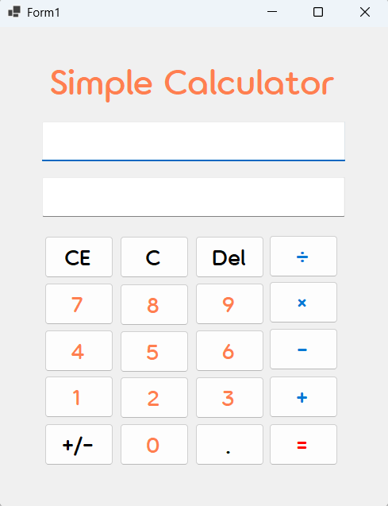

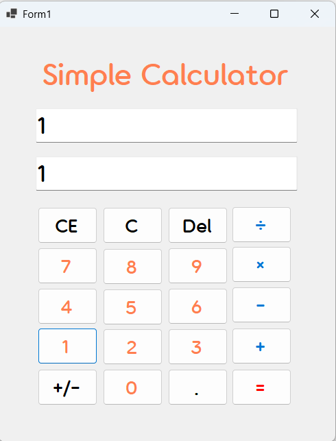

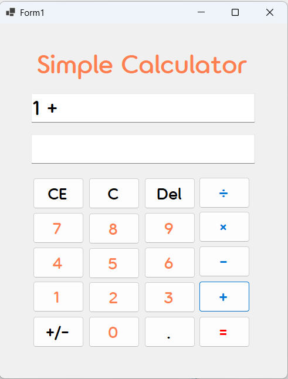

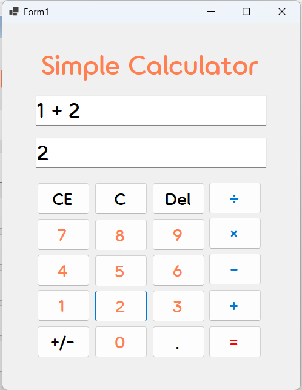

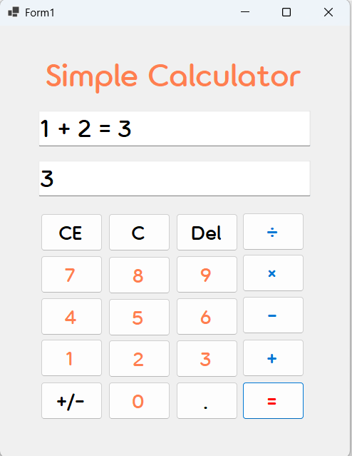

- 과제 내용
  - Label(텍스트 표시), TextBox(수식 및 결과 표시), Button(숫자 패드 및 연산자) 컨트롤을 폼 화면에 적절히 배치하고 속성을 설정합니다.
  - 숫자 버튼을 클릭했을 때 TextBox 영역에 해당 숫자가 텍스트 형태로 누적되어 입력되도록 구현합니다.
  - 2개의 피연산자 입력값을 int형으로 바꾸어 더하기(+) 연산을 수행한 뒤, 결과를 저장합니다.
  - 계산 결과 값을 문자열로 변환하여 입력 내용 전체 표시 및 최종 결과값 표시라는 2가지 방법으로 출력되도록 구현합니다.

- 구현 내용과 기능 설명
  - Windows 폼 상단에 연산의 전체 과정을 기록할 보조 출력창을 두고, 그 바로 아래에 현재 누른 숫자와 최종 결과값을 직관적으로 띄워줄 메인 입력창을 배치하여 시각적인 데이터 흐름을 완벽히 분리했습니다.
  - 0부터 9까지의 숫자 버튼들에 클릭 이벤트를 연결하고, 이벤트 발생 시 클릭된 특정 버튼의 텍스트 값을 가져와 메인 입력 창에 문자열 결합 방식으로 연속해서 이어 붙여지도록 코딩했습니다.
  - 사용자가 덧셈(+) 버튼을 클릭하면 메인 입력창의 텍스트를 int.Parse()를 이용해 숫자로 변환하여 전역 변수에 보관합니다. 동시에 상단 보조 창에는 문자열 보간법을 사용해 첫 번째 피연산자와 덧셈 기호를 함께 출력하여 입력 과정을 표시하고 메인 창을 비웠습니다.
  - 계산(=) 버튼 클릭 시 두 번째 피연산자까지 받아와 덧셈 연산을 수행하며, 계산된 정수형 결과값은 ToString()을 통해 다시 문자로 가공하여 하단 창에 띄우고 상단에는 전체 수식을 출력하도록 완성했습니다.

## 실행 화면 (과제2)
- 과제2 코드의 실행 스크린샷

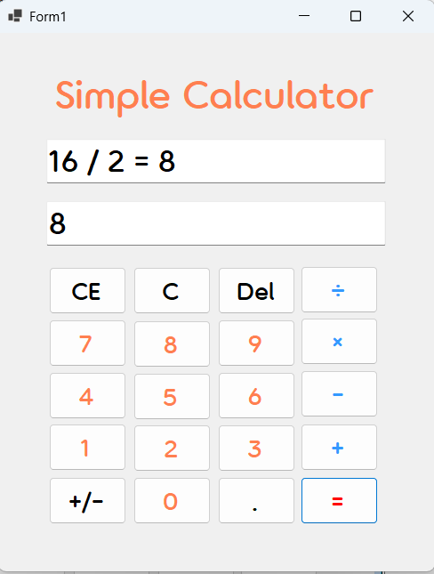

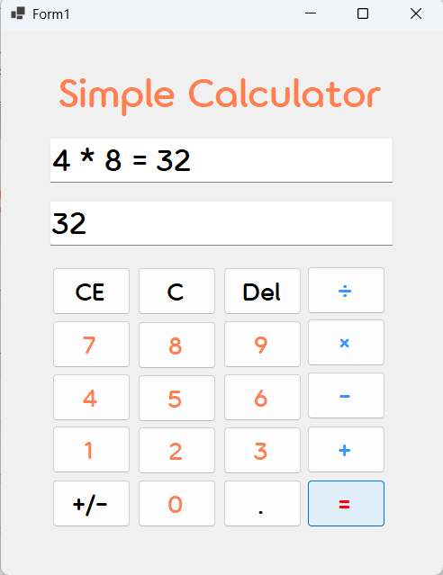

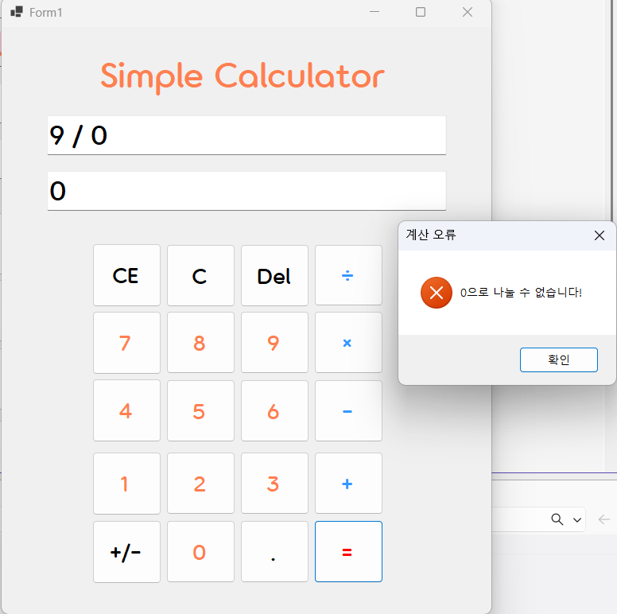

- 과제 내용
  - 기존 덧셈 기능에 더해 뺄셈(-), 곱셈(*), 나눗셈(/) 버튼을 추가하여 사칙연산 기능을 완벽히 구성합니다.
  - 각 사칙연산 버튼 클릭 시 연산자 기호만 적절하게 변경하여 과제1과 동일한 로직이 적용되도록 구현합니다.

- 구현 내용과 기능 설명
  - 기존 더하기 버튼의 레이아웃을 바탕으로 뺄셈, 곱셈, 나눗셈 기능을 담당할 Button 컨트롤들을 폼 화면에 추가로 배치하여 실제 계산기의 구색을 온전히 갖추었습니다.
  - 새롭게 추가된 각 사칙연산 버튼에 Click 이벤트를 개별적으로 연결했습니다. 연산 버튼을 누를 때마다 첫 번째 피연산자 문자열을 int로 변환해 저장하고, 보조 창에 연산 기호가 덧붙여진 수식이 시각적으로 나타나도록 코드를 작성한 뒤 메인 창을 비웠습니다.
  - 최종 계산을 수행하는 계산(=) 버튼의 클릭 이벤트 내부에는 사용자가 마지막으로 누른 연산자가 무엇인지 판별하는 분기 처리를 구현하여 알맞은 산술 연산이 정확히 분기되어 실행되도록 기능을 고도화했습니다.

## 실행 화면 (과제3)
- 과제3 코드의 실행 스크린샷

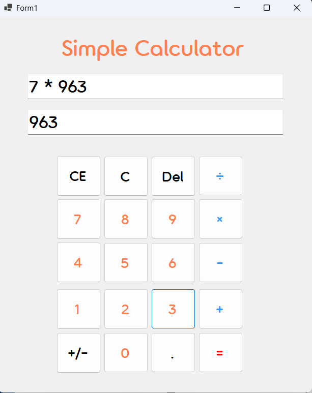

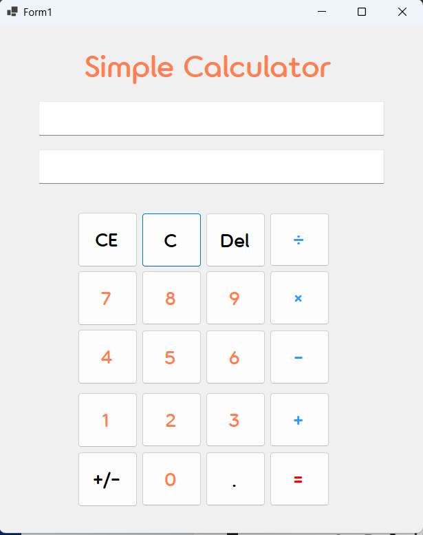

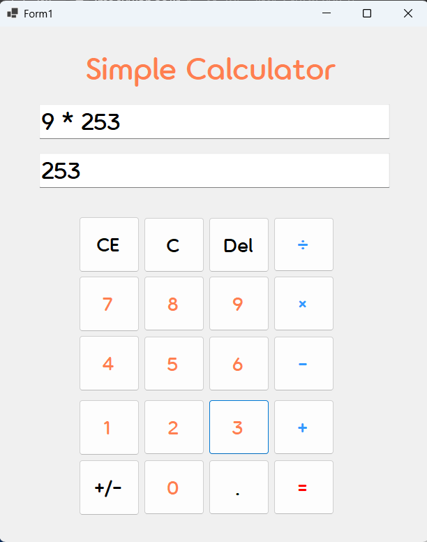

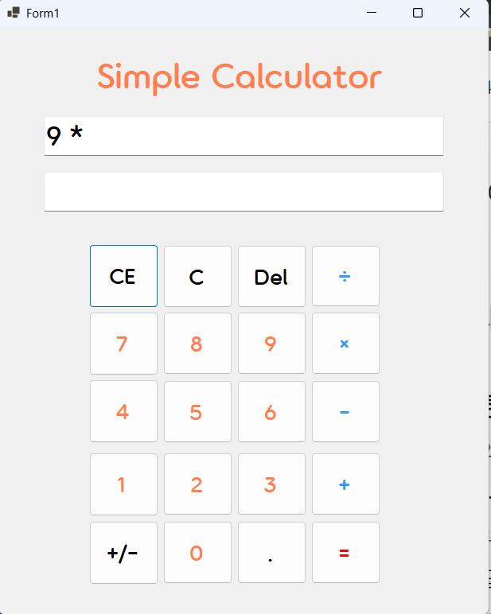

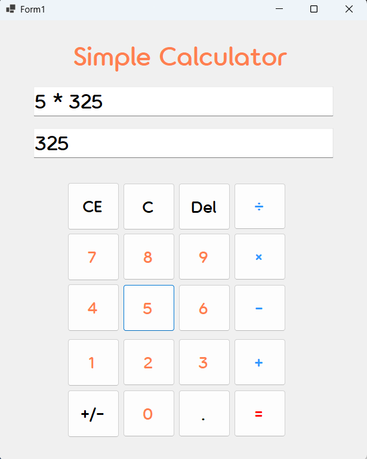

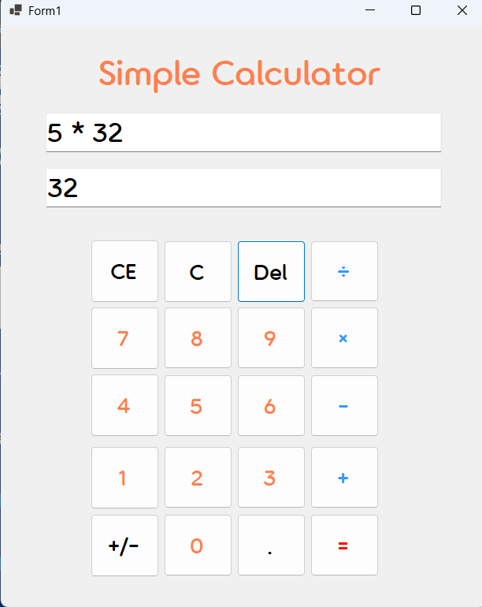

- 과제 내용
  - 잘못된 입력을 사용자가 직접 수정할 수 있도록 계산기에 필수적인 C, CE, Del 버튼 수정 및 삭제 기능을 추가로 구현합니다.
  - C (Clear) 버튼: 현재의 모든 내용(수식 및 숫자)을 삭제하고 처음 초기화된 상태로 되돌아갑니다.
  - CE (Clear Entry) 버튼: 마지막에 입력한 피연산자 값을 삭제합니다.
  - Del (Delete) 버튼: 마지막에 입력된 글자 하나(숫자 하나) 값을 삭제합니다.

- 구현 내용과 기능 설명
  - 숫자 패드 상단에 수정 및 삭제를 담당할 C, CE, Del 버튼 컨트롤을 새롭게 배치하고 각각에 클릭 이벤트를 연결하여 계산기의 입력 편의성을 극대화했습니다.
  - C 버튼: 클릭 시 메인 입력창과 보조 출력창의 문자열을 모두 지우고, 연산을 위해 저장해둔 전역 변수 상태까지 초기화하여 프로그램을 처음 켠 상태로 완벽히 되돌리는 전체 초기화 로직을 작성했습니다.
  - CE 버튼: 사용자가 연산 과정 중에 숫자를 잘못 입력했을 때 기존 수식을 전부 날리는 불편함을 막고자 구현했습니다. 이 버튼을 누르면 마지막에 입력한 피연산자 값만 통째로 삭제 처리하여 해당 부분만 다시 입력할 수 있도록 상태를 제어했습니다.
  - Del 버튼: 사용자가 클릭할 때마다 문자열에서 맨 마지막 글자 하나만 정확하게 지워지고 화면에 다시 띄워지는 방식으로 정밀한 백스페이스 기능을 완성했습니다.

## 실행 화면 (과제4)
- 과제4 코드의 실행 스크린샷

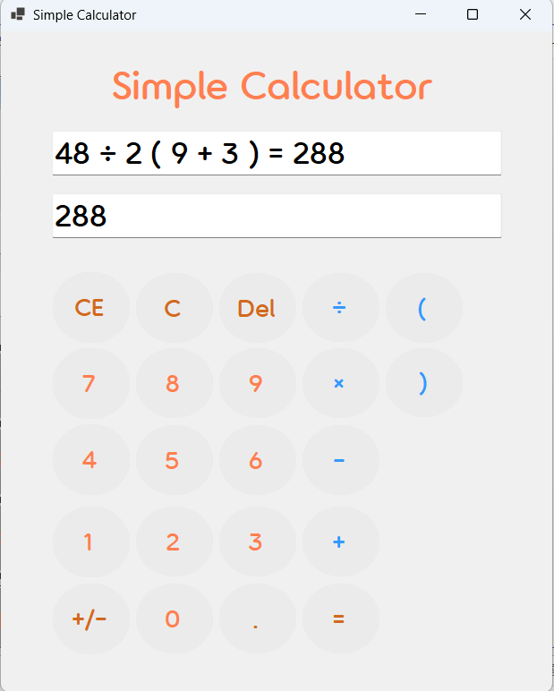

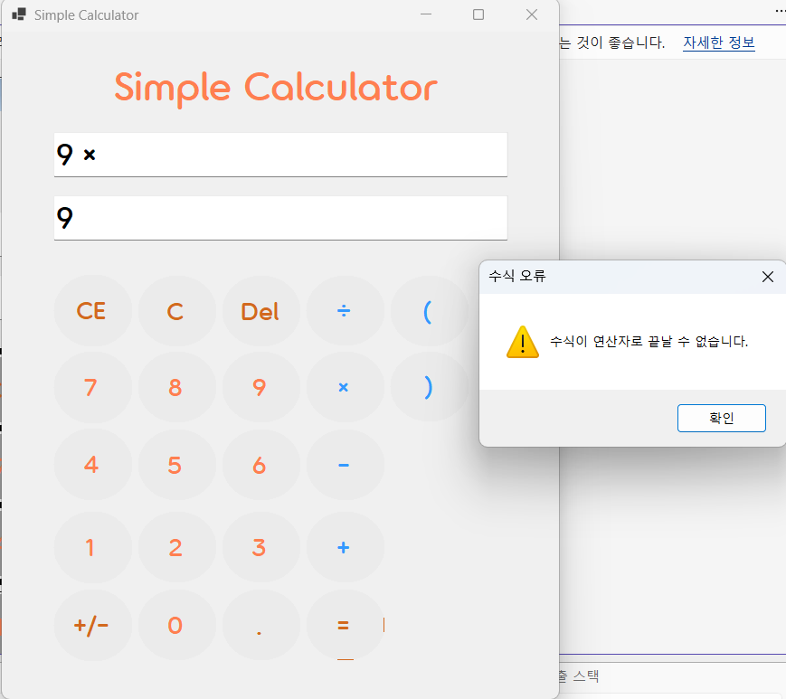

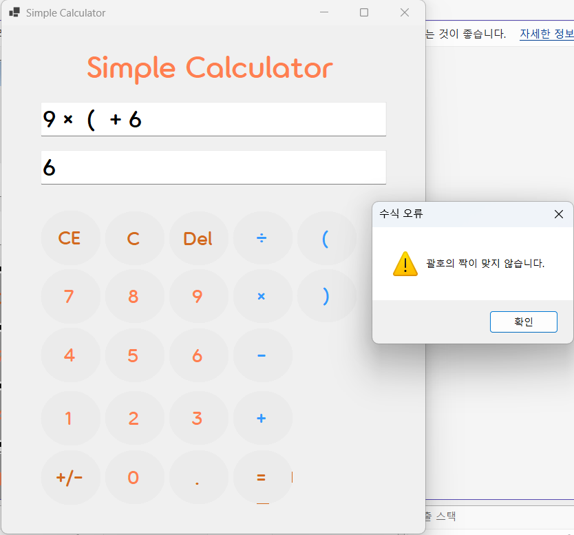

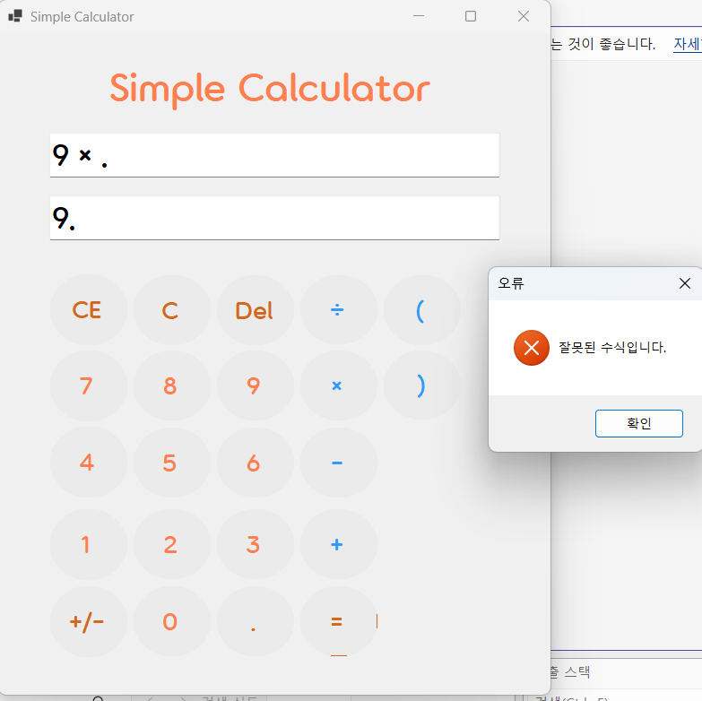

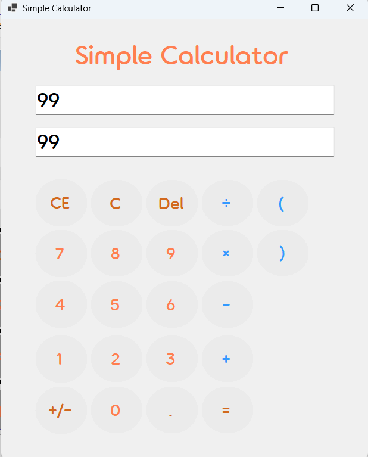

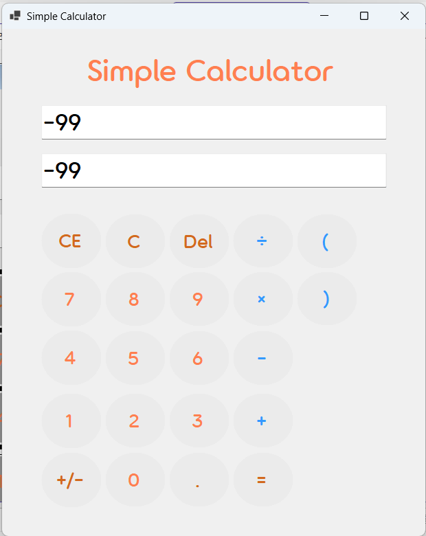

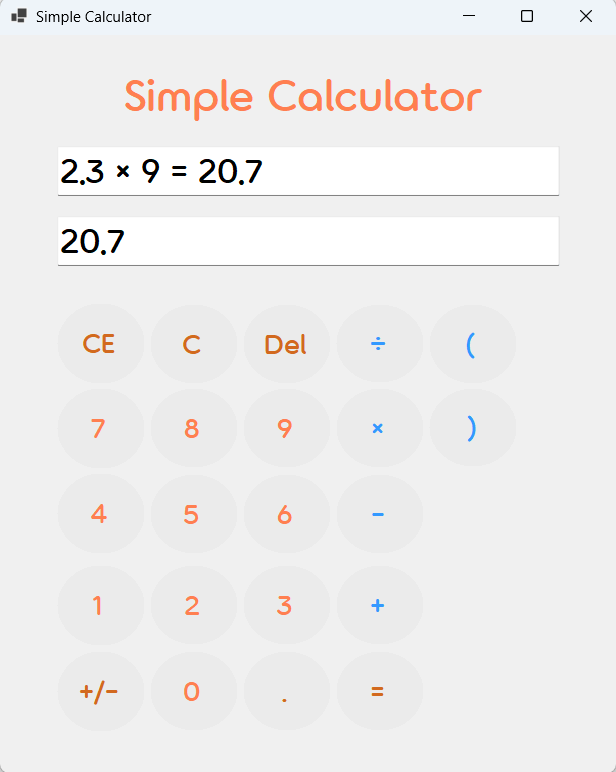

- 과제 내용
  - 수식의 우선순위를 제어할 수 있는 소수점(.), 부호 전환(+/-), 괄호((, )) 연산 기능을 추가로 구현합니다.
  - 단순 순차 연산 방식에서 벗어나 곱셈과 나눗셈을 먼저 처리하는 수학적 사칙연산 우선순위 로직을 적용합니다.
  - 연산자를 중복으로 입력할 경우(예: +를 누른 후 바로 ×를 누름) 마지막에 입력한 연산자로 수식이 자동 교체되도록 제어합니다.
  - 사용자가 곱하기 기호를 생략하여 입력하더라도(예: 2(3+4)) 프로그램이 이를 자동으로 인식하여 연산하도록 기능을 고도화합니다.
  - 0으로 나누기, 괄호 쌍 불일치, 연산자로 끝나는 잘못된 수식 입력 등에 대한 예외 처리와 경고 메시지 시스템을 구축합니다.
  - 프로그램 실행 시 창 제목(Form Title)을 "Simple Calculator"로 설정하고, 모든 버튼을 완전한 원형으로 커스텀 스타일링합니다.

- 구현 내용과 기능 설명
  - 시스템 안정성을 확보하기 위해 DataTable.Compute 메서드를 도입하여 괄호와 사칙연산 우선순위가 포함된 복잡한 문자열 수식을 일괄 분석하고 결과값을 도출하는 고급 연산 엔진을 구축했습니다.
  - 정규표현식(Regex.Replace)을 전처리 로직에 활용하여 숫자와 여는 괄호 사이, 혹은 닫는 괄호와 숫자 사이에 생략된 곱셈 기호를 찾아내어 내부적으로 별표(*) 연산자를 강제 삽입함으로써 공학적 수식 입력의 편의성을 극대화했습니다.
  - 사용자가 연산자를 실수로 잘못 눌렀을 때 지우고 다시 입력하는 번거로움을 줄이기 위해, 마지막 문자가 연산자일 때 새로운 연산자가 들어오면 문자열 끝을 잘라내고 교체하는 스마트 연산자 스왑 로직을 적용했습니다.
  - 계산 시작 전 검증 절차를 강화하여 수식이 기호로 끝나거나 괄호 개수가 맞지 않을 경우 MessageBox.Show()를 통해 사용자에게 원인을 알리고, 0으로 나누기 시 발생하는 Infinity/NaN 결과값을 감지하여 친절한 안내 메시지를 출력하도록 방어적 프로그래밍을 완성했습니다.
  - UI 디자인의 완성도를 위해 GraphicsPath와 Region 속성을 제어하는 별도의 메서드를 작성했습니다. 폼 로드 시 모든 버튼 컨트롤을 순회하며 FlatStyle 적용 및 테두리 제거와 함께 영역을 완전히 원형으로 깎아내어 세련되고 일관성 있는 디자인 테마를 구현했습니다.